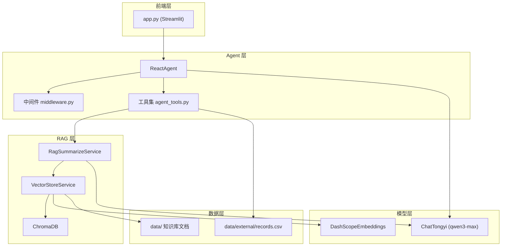

# 智扫通 ZhiSaoTong

> 扫地机器人 RAG + ReAct Agent 智能客服系统

**GitHub：** [https://github.com/FanSail42/ZhiSaoTong](https://github.com/FanSail42/ZhiSaoTong)

---

## 项目简介

**智扫通（ZhiSaoTong）** 是一个面向扫地机器人 / 扫拖一体机器人领域的智能客服系统，融合 **RAG（检索增强生成）** 与 **ReAct Agent（推理 + 行动）** 能力。

系统基于 LangChain Agent 与 LangGraph 构建：模型先判断用户需求，再按需调用工具获取信息，最终生成专业、可落地的回答。同时集成向量检索，从本地知识库中召回产品问答、维护保养、故障排除、选购指南等资料。

前端使用 Streamlit 提供对话式 Web 界面，支持流式输出与多轮对话。

---

## 技术栈

| 类别 | 技术 |
|------|------|
| 大语言模型 | 阿里云通义千问 `qwen3-max`（DashScope API） |
| 向量模型 | `text-embedding-v4`（DashScope Embeddings） |
| Agent 框架 | LangChain 1.x + LangGraph |
| 向量数据库 | ChromaDB |
| Web 界面 | Streamlit |
| 配置管理 | YAML |
| 文档加载 | PyPDF、TextLoader（支持 PDF / TXT） |

**主要依赖版本：** `langchain==1.2.17`、`langchain-chroma==1.1.0`、`chromadb==1.5.9`、`streamlit==1.57.0`、`dashscope==1.25.17`

---

## 系统架构



---

## 目录结构

```
智扫通/
├── app.py                    # Streamlit 主入口，对话界面
├── agent/
│   ├── react_agent.py        # ReAct Agent 核心封装
│   └── tools/
│       ├── agent_tools.py    # 7 个 Agent 工具定义
│       └── middleware.py     # 工具监控、日志、动态提示词切换
├── rag/
│   ├── rag_service.py        # RAG 检索 + 总结服务
│   └── vector_store.py       # Chroma 向量库管理、文档入库
├── model/
│   └── factory.py            # 大模型与 Embedding 工厂
├── config/
│   ├── agent.yml             # Agent 外部数据路径
│   ├── chroma.yml            # 向量库配置
│   ├── rag.yml               # 模型名称配置
│   └── prompts.yml           # 提示词文件路径
├── prompts/
│   ├── main_prompt.txt       # 系统主提示词（客服场景）
│   ├── rag_summarize.txt     # RAG 总结提示词
│   └── report_prompt.txt     # 使用报告生成提示词
├── data/
│   ├── 扫地机器人100问2.txt
│   ├── 扫拖一体机器人100问.txt
│   ├── 故障排除.txt
│   ├── 维护保养.txt
│   ├── 选购指南.txt
│   ├── 扫地机器人100问.pdf
│   └── external/
│       └── records.csv       # 用户使用记录（报告生成）
├── utils/
│   ├── config_handler.py     # YAML 配置加载
│   ├── file_handler.py       # 文件 MD5、PDF/TXT 加载
│   ├── logger_handler.py     # 日志（控制台 + 文件）
│   ├── path_tool.py          # 项目路径工具
│   └── prompt_loader.py      # 提示词加载
├── chroma_db/                # 向量库持久化目录
├── logs/                     # 运行日志
└── md5.text                  # 已入库文件的 MD5 去重记录
```

---

## 核心模块

### 前端入口（`app.py`）

- 标题：「智扫通机器人智能客服」
- 使用 `st.session_state` 保持 Agent 实例与对话历史
- 用户输入后调用 `ReactAgent.execute_stream()` 流式返回
- 通过 `write_stream` 实现逐字打字机效果

### ReAct Agent（`agent/react_agent.py`）

基于 `langchain.agents.create_agent` 创建，配置：

- **模型：** 通义千问 `qwen3-max`
- **系统提示词：** `prompts/main_prompt.txt`
- **工具：** 7 个（见下表）
- **中间件：** 工具监控、模型调用前日志、动态提示词切换

流式执行时传入 `context={"report": False}`，用于区分普通客服与报告生成场景。

### Agent 工具集

| 工具名 | 功能 |
|--------|------|
| `rag_summarize` | 从向量库检索参考资料并总结回答 |
| `get_weather` | 获取指定城市天气（模拟数据） |
| `get_user_location` | 获取用户所在城市（随机：深圳/合肥/杭州） |
| `get_user_id` | 获取用户 ID（1001–1010 随机） |
| `get_current_month` | 获取当前月份（2025-01 至 2025-12 随机） |
| `fetch_external_data` | 从 CSV 读取指定用户、月份的使用记录 |
| `fill_context_for_report` | 触发报告场景，切换为报告生成提示词 |

### 中间件（`agent/tools/middleware.py`）

- **`monitor_tool`：** 记录工具调用名称、参数与结果；调用 `fill_context_for_report` 时将 `context["report"]` 设为 `True`
- **`log_before_model`：** 模型调用前记录消息数量与内容
- **`report_prompt_switch`：** 动态提示词——`report=True` 时加载 `report_prompt.txt`，否则加载 `main_prompt.txt`

### RAG 服务（`rag/`）

**向量存储（`vector_store.py`）：**

- 使用 ChromaDB，集合名 `agent`，持久化到 `chroma_db/`
- 文本分片：chunk_size=200，overlap=20
- 支持从 `data/` 加载 TXT、PDF，按 MD5 去重避免重复入库
- 检索 Top-K=3

**总结服务（`rag_service.py`）：**

1. 向量检索相关文档
2. 拼接为参考资料上下文
3. 结合 `rag_summarize.txt` 提示词调用大模型生成简洁中文回答

### 模型工厂（`model/factory.py`）

通过工厂模式创建 `ChatTongyi` 对话模型与 `DashScopeEmbeddings` 向量模型，名称在 `config/rag.yml` 中配置。

---

## 业务流程

### 普通问答

```
用户提问 → Agent 思考 → 按需调用工具（如 rag_summarize、get_weather）
         → 整合信息 → 流式返回专业回答
```

### 报告生成（强约束流程）

当用户请求「生成使用报告」时，Agent 需按固定顺序执行：

```
get_user_id → get_current_month → fill_context_for_report
→ fetch_external_data → 切换 report_prompt → 生成 Markdown 报告
```

报告标题为「黑马程序员扫地机器人使用情况报告与保养建议」。

### 知识库入库

```bash
python rag/vector_store.py
```

扫描 `data/` 下 TXT/PDF → MD5 去重 → 分片 → 写入 ChromaDB。

---

## 配置说明

| 配置文件 | 主要项 |
|----------|--------|
| `config/rag.yml` | `chat_model_name: qwen3-max`、`embedding_model_name: text-embedding-v4` |
| `config/chroma.yml` | 集合名、持久化路径、分片参数、检索 K 值、数据目录 |
| `config/agent.yml` | 外部数据 CSV 路径 |
| `config/prompts.yml` | 三类提示词文件路径 |

**环境要求：** 需配置阿里云 DashScope API Key（通常通过环境变量 `DASHSCOPE_API_KEY`）。

---

## 快速开始

### 1. 激活虚拟环境

```powershell
cd "项目根目录"
.\venv\Scripts\Activate.ps1
```

### 2. 配置 API Key

```powershell
$env:DASHSCOPE_API_KEY = "your-api-key"
```

### 3. 首次使用：构建知识库（可选）

```powershell
python rag/vector_store.py
```

### 4. 启动 Web 应用

```powershell
streamlit run app.py
```

### 5. 单独测试

```powershell
# 测试 Agent
python agent/react_agent.py

# 测试 RAG
python rag/rag_service.py
```

---

## 知识库与数据

**知识库文档（`data/`）：**

- 扫地机器人 / 扫拖一体机器人常见问答
- 故障排除、维护保养、选购指南

**外部使用记录（`data/external/records.csv`）：**

- 10 个用户（1001–1010）
- 每人 12 个月（2025-01 至 2025-12）的使用数据
- 字段：用户 ID、居住特征、清洁效率、耗材状态、对比分析、时间

---

## 日志

日志目录：`logs/`，按日期命名（如 `agent_20260618.log`）。

记录内容：工具调用、模型调用、知识库加载、错误堆栈等，便于调试与监控。

---

## 项目特点

1. **ReAct + RAG：** 推理与工具调用结合，知识库增强回答准确性
2. **动态提示词：** 通过中间件在客服与报告场景间自动切换
3. **工具链完整：** 知识检索、天气、用户身份、外部数据等
4. **可配置：** 模型、向量库、提示词均通过 YAML 管理
5. **知识库去重：** MD5 机制避免重复向量化
6. **流式交互：** Streamlit 流式输出，体验接近实时对话

---

## 注意事项

1. 依赖见项目根目录 `requirements.txt`，安装命令：`pip install -r requirements.txt`
2. `get_weather`、`get_user_location`、`get_user_id`、`get_current_month` 为模拟数据，生产环境需对接真实 API
3. 存在多处 `chroma_db` 目录，实际使用的是 `config/chroma.yml` 中配置的 `chroma_db`
4. 需有效 DashScope API Key 才能正常调用大模型与 Embedding

---

## 命名说明

| 项 | 内容 |
|----|------|
| 中文名 | **智扫通** |
| 英文名 | **ZhiSaoTong** |
| 全称 | 智扫通机器人智能客服 |
| 定位 | 扫地 / 扫拖机器人领域的 RAG + ReAct Agent 智能客服 |

「智扫通」取「智能清扫、一通百通」之意，体现 Agent 自主推理与知识检索相结合的产品定位。
